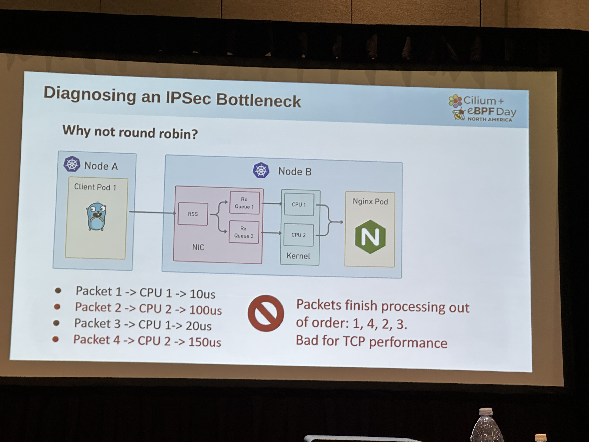
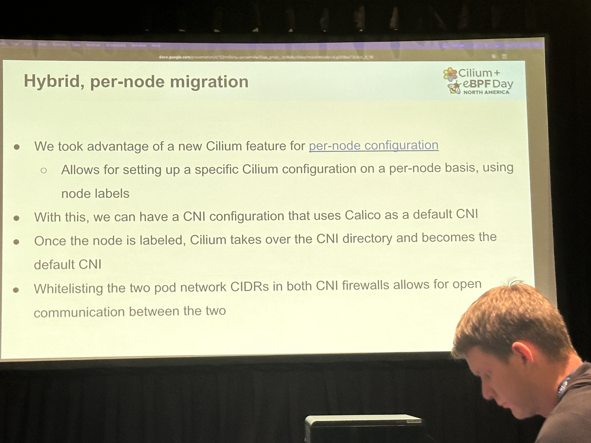
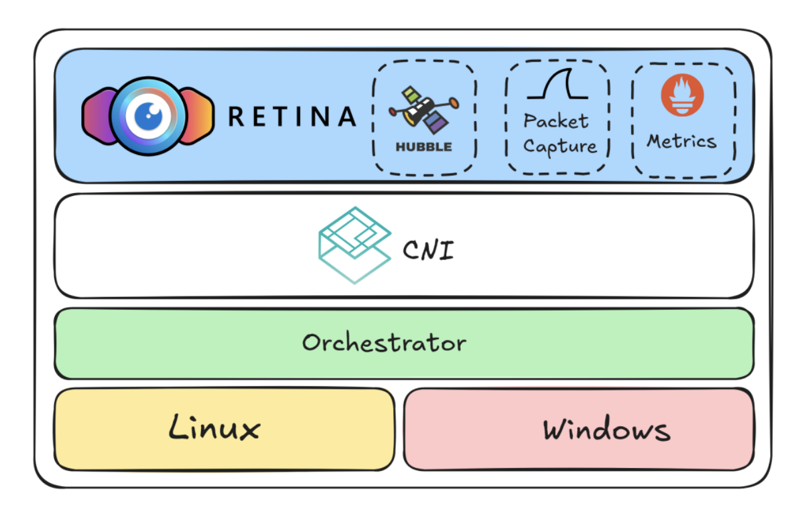

- [Starting the New Day](#starting-the-new-day)
- [Kickoff Highlights](#kickoff-highlights)
- [Standout Talks](#standout-talks)
  - [How to Use XDP and eBPF to Accelerate IPSec Throughput by 400%](#how-to-use-xdp-and-ebpf-to-accelerate-ipsec-throughput-by-400)
  - [Live Migrating Production Clusters From Calico to Cilium](#live-migrating-production-clusters-from-calico-to-cilium)
  - [Hubble Beyond Cilium](#hubble-beyond-cilium)

## Starting the New Day

Much of the snow did not stick to the floor but instead my hair and jacket. 😶‍🌫️

As someone interested in eBPF, having researched and developed some eBPF programming, I was especially excited for this
convention.

## Kickoff Highlights

- A dozen new Cilium case studies from CNCF!
- Cilium 1.16 Release
  - netkit release (as performant as `host` network)
  - multicast, Gateway API 1.1 support
  - Improved DNS-based netpol performance (5x reduction in latency)
  - Cilium memory usage reduced by ~24%
- eBPF is officially standardized under the IETF (RFC 9669)
- eBPF threat model [published](https://github.com/ebpffoundation/publications/blob/main/2024/ControlPlane_eBPF_Security_Threat_Model.pdf)
- [State of eBPF Report (Jan 2024)](https://github.com/ebpffoundation/publications/blob/main/2024/The_State_of_eBPF.pdf)

## Standout Talks

The schedule was chock-full of experience. From interesting journeys to yet another problem solved by eBPF, it was
an overwhelming amount of information.

- Confluent's Multi-Cloud Journey into Cilium
- Insightful Traffic Monitoring: Harnessing Cilium for Comprehensive Network Observability
- eBPF for Creating Least Privileged Policies
- Reinventing Seccomp for Fun and Profiles
- Exploring eBPF Use Cases in Cloud-Native Security
- Scaling Network Policy Enforcement Beyond the Cluster Boundary with Cilium
- Lessons Learned Migrating to Modern Multi-Platform eBPF Programs

### How to Use XDP and eBPF to Accelerate IPSec Throughput by 400%

Fascinating to find myself following along with an experienced kernel dweller walking us through impressive gains in
accelerating IPSec packet transmission by parallelizing flows.

TIL about the Toeplitz hashing method leveraged at the NIC level to distribute packets. This in turn unlocked the use of
more than one core and naturally amplified throughput to unprecedented levels. I also learned that out of the box, eBPF
programs will be pinned to a single core. One process, one or more threads pinned to a core. Ryan stated it is seemingly
impossible to evenly distribute across multiple cores meaning sporadic bottlenecks at scale even with the gains seen here.

For our rate limiter we tapped into XDP but I could see, in retrospect, that we may have suffered from the CPU pinning
mentioned.

Maybe I should look at Toeplitz/RSS as well. 🤔

Duffie of Isovalent suggested a particular Slack channel worth checking out for advice and bouncing ideas.

### Live Migrating Production Clusters From Calico to Cilium

The folks over at SamsungAds gave us a tour down memory lane in reliving their migration from Calico to Cilium.

I’ve experimented with `k3s` and `kind`, yielding mixed results. Recently, I learned about Cilium’s new feature set
supporting CNI coexistence, which promises a smoother and more coordinated transition--perhaps signaling the end for
Multus? 😏

As part of their demo:

- Cilium was deployed via helm chart in the per-node configuration
- An existing Calico node was cordoned, drained and labeled to set Cilium as default CNI
- Cilium on target node restarted to initiate proper takeover
- Validate with `cilium status`
- Uncordon, restart node workloads (so Cilium can manage)
- Rinse and repeat

The demo was surprisingly straightforward. And then the other shoe dropped. ~20 clusters, multi-tenant, ranging from 10
to 500 nodes per cluster, **no network policies**. 😒 Figured they may have been using Kubernetes native network policies
and the steps taken were sufficient but surely not.

To account for network policies, we could:

- Deploy Cilium network policy counterparts
  - If only there were netpol translation tooling
- Ensure 100% coverage (validation script checking netpol 1-to-1)
- Initiate per-node transition (repaves could work too albeit workloads will be pushed across the cluster)

### Hubble Beyond Cilium

Microsoft have developed a CNI-agnostic alternative to Hubble, called [Retina](https://retina.sh/)! It uses Hubble under
the hood with added versatility for exporting metrics and traces.

They are well aware of the reuse of existing tech. The xkcd they showed was comically fitting:

The best bet to Hubble-level observability without Cilium.
